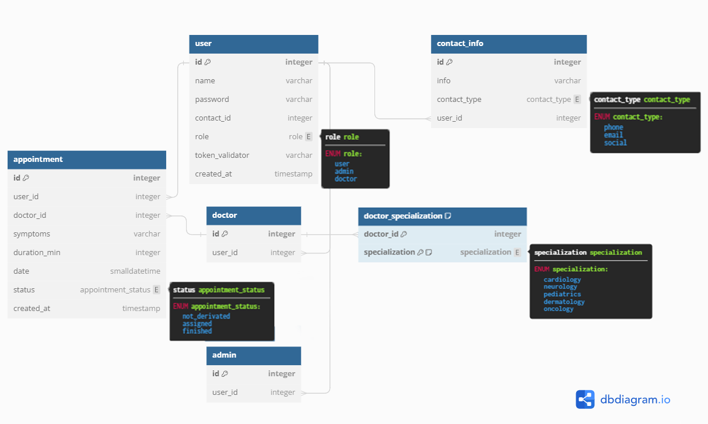

# Hospital Appointment Scheduler API documentation

# Content
- [Objective](#objective)
- [Features](#features)
- [API Reference Endpoints](#api-reference-endpoints)
    - [Common responses](#common-responses)
    - [User](#user)
    - [Specialization](#specialization)
    - [Doctor](#doctor)
    - [Appointment](#appointment)
- [Models](#models)
- [Errors](#errors)
- [Database](#database)
- [Tech Stack](#tech-stack)

# Objective
Create a hospital appointment scheduling system. Patients can enter their symptoms or required specialization (e.g., cardiology, surgery), and the system will find the nearest available appointment date with a doctor of the specified specialization. The system should consider doctor availability, patient load, and appointment duration.


# Features

- User management, by admin
- Specialization management, by admin
- Appointment creation with specialization, by user
- Appointment creation with symptoms, by user
- Appointment management, by user
- Appointment derivation, by admin


# API Reference Endpoints

## Endpoint Authorization
Every request header should include a JWT for Authorization.

See [Auth API](https://github.com/MelnikAndres/Solvd/blob/main/hospital_auth/README.md)

```
header:
    {
        ...
        Authorization: bearer <access_token>
        ...
    }
```


## Common responses
If any request that requires an id has an invalid or missing id, response will be:
```
    HTTP/1.1 404 Not Found
```

If any request that requires a body has invalid or missing data, response will be:
```
    HTTP/1.1 400 Bad Request
    Content-Type: application/json
    {ERROR_INVALID_FIELDS}
```
- see [ERROR_INVALID_FIELDS](#error-invalid-fields)

If any request has an expired or invalid token, respone will be:
```
    HTTP/1.1 403 Forbidden
    Content-Type: application/json
    {ERROR_INVALID_TOKEN}
```

- see [ERROR_INVALID_TOKEN](#error-invalid-token)


## User

### Get all users
Auth requirement: Admin level

```
  GET /api/users
```

- Query parameters

| Parameter | Type     | Description                |
| :-------- | :------- | :------------------------- |
| `role` | `string` | Optional. Role filtering|
| `name` | `string` | Optional. Name filtering|
| `page` | `string` | Optional. Pagination|

- Response
    - Valid request
    ```
        HTTP/1.1 200 OK
        Content-Type: application/json 
        {
            "users": [
            {USER_MODEL},
            ]
        }
        
    ```
- Models
    
    see [USER_MODEL](#user-model)


### Create user
Auth requirement: Admin level
```
  POST /api/users

```

- Body structure (JSON)

| Property | Type     | Description                       |
| :-------- | :------- | :-------------------------------- |
| `name` | `string` | **Required**. username|
| `password` | `string` | **Required**. password|
| `role` | `string` | **Required**. user role|

- Response:
    - Valid request
    ```
        HTTP/1.1 200 OK
        Content-Type: application/json
        {USER_MODEL}
    ```
- Models 

    see [USER_MODEL](#user-model)

### Get user
Auth requirement: Admin Level or Same User
```
  GET /api/users/${id}
```

- Query parameters


| Parameter | Type     | Description                       |
| :-------- | :------- | :-------------------------------- |
| `id`      | `integer` | **Required**. Id of user|

- Response:
    - Valid request
    ```
        HTTP/1.1 200 OK
        Content-Type: application/json
        {USER_MODEL}
    ```

- Models 

    see [USER_MODEL](#user-model)

### Update user
Auth requirement: Admin Level or Same User

```
  PUT /api/users/${id}
```

- Query parameters


| Parameter | Type     | Description                       |
| :-------- | :------- | :-------------------------------- |
| `id`      | `integer` | **Required**. Id of user|

- Body structure (JSON)

| Property | Type     | Description                       |
| :-------- | :------- | :-------------------------------- |
| `name` | `string` | **Optional**. username (admin only)|
| `new_password` | `string` | **Optional**. new password|
| `password` | `string` | **Required**. current password|
| `contact` | `string` | **Optional**. contact method info|
| `contact_type` | `string` | **Optional**. contact method type|
| `contact_id` | `string` | **Optional**. contact id (to overwrite)|

- Response
    - Valid request
    ```
        HTTP/1.1 200 OK
        Content-Type: application/json
        {USER_MODEL}
    ```

- Models 

    see [USER_MODEL](#user-model)


### Delete user
Auth requirement: Admin Level

```
  DELETE /api/users/${id}
```

- Query parameters


| Parameter | Type     | Description                       |
| :-------- | :------- | :-------------------------------- |
| `id`      | `integer` | **Required**. Id of user|

- Response
    - Valid request
```
    HTTP/1.1 204 No Content
```

## Specialization

### Get all specializations
Auth requirement: User level

```
  GET /api/specializations
```

- Response
    - Valid request
    ```
        HTTP/1.1 200 OK
        Content-Type: application/json 
        {
            "users": [
            {SPECIALIZATION_MODEL},
            {SPECIALIZATION_MODEL}
            ]
        }
        
    ```
- Models
    
    see [SPECIALIZATION_MODEL](#specialization-model)

### Create specialization
Auth requirement: Admin level
```
  POST /api/specialization
  
```

- Body structure (JSON)

| Property | Type     | Description                       |
| :-------- | :------- | :-------------------------------- |
| `name` | `string` | **Required**. Specialization name|

- Response:
    - Valid request
    ```
        HTTP/1.1 200 OK
        Content-Type: application/json
        {SPECIALIZATION_MODEL}
    ```
- Models 

    see [SPECIALIZATION_MODEL](#specialization-model)

### Update specialization
Auth requirement: Admin level

```
  PUT /api/specialization/${id}
```

- Query parameters


| Parameter | Type     | Description                       |
| :-------- | :------- | :-------------------------------- |
| `id`      | `integer` | **Required**. Id of specialization|

- Body structure (JSON)

| Property | Type     | Description                       |
| :-------- | :------- | :-------------------------------- |
| `id`      | `integer` | **Required**. Id of specialization|
| `name` | `string` | **Required**. Specialization name|

- Response
    - Valid request
    ```
        HTTP/1.1 200 OK
        Content-Type: application/json
        {SPECIALIZATION_MODEL}
    ```
- Models 

    see [SPECIALIZATION_MODEL](#specialization-model)

### Delete specialization
Auth requirement: Admin level

```
  DELETE /api/specialization/${id}
```

- Query parameters


| Parameter | Type     | Description                       |
| :-------- | :------- | :-------------------------------- |
| `id`      | `integer` | **Required**. Id of specialization|

- Response
    - Valid request
```
    HTTP/1.1 204 No Content
```
## Doctor

### Add doctor specialization
Auth requirement: Admin level

```
  PUT /api/doctor/${id}
```

- Query parameters


| Parameter | Type     | Description                       |
| :-------- | :------- | :-------------------------------- |
| `id`      | `integer` | **Required**. Id of doctor|
| `sp_id`      | `integer` | **Required**. Id of specialization|

- Response
    - Valid request
    ```
        HTTP/1.1 200 OK
        Content-Type: application/json
        {DOCTOR_MODEL}
    ```
- Models 

    see [DOCTOR_MODEL](#doctor-model)

### Delete doctor specialization
Auth requirement: Admin level

```
  DELETE /api/doctor/${id}
```

- Query parameters


| Parameter | Type     | Description                       |
| :-------- | :------- | :-------------------------------- |
| `id`      | `integer` | **Required**. Id of doctor|
| `sp_id`      | `integer` | **Required**. Id of specialization|

- Response
    - Valid request
    ```
        HTTP/1.1 200 OK
        Content-Type: application/json
        {DOCTOR_MODEL}
    ```
- Models 

    see [DOCTOR_MODEL](#doctor-model)

## Appointment

### Create appointment
Auth requirement: Admin level or same user
```
  POST /api/appointment

```

- Body structure (JSON)

| Property | Type     | Description                       |
| :-------- | :------- | :-------------------------------- |
| `id`      | `integer` | **Required**. user id|
| `symptoms` | `string` | **Optional**. symptoms|
| `specialization_id` | `integer` | **Optional**. specialization id|

- Response:
    - Valid request
    ```
        HTTP/1.1 200 OK
        Content-Type: application/json
        {APPOINTMENT_MODEL}
    ```
- Models 

    see [APPOINTMENT_MODEL](#appointment-model)

### Get appointment
Auth requirement: Admin level or same user

```
  GET /api/appointment/${id}
```

- Query parameters


| Parameter | Type     | Description                       |
| :-------- | :------- | :-------------------------------- |
| `id`      | `integer` | **Required**. Id of appointment|
| `user_id` | `integer` | **Required**. Id of user|


- Response:
    - Valid request
    ```
        HTTP/1.1 200 OK
        Content-Type: application/json
        {APPOINTMENT_MODEL}
    ```

- Models 

    see [APPOINTMENT_MODEL](#appointment-model)

### Get appointments
Auth requirement: Admin level or same user

```
  GET /api/appointment
```

- Query parameters


| Parameter | Type     | Description                       |
| :-------- | :------- | :-------------------------------- |
| `user_id` | `integer` | **Optional**. Id of user (required if not admin)|
| `from` | `integer` | **Optional**. filter by starting day|
| `to` | `integer` | **Optional**. filter by last day|
| `specialization_id` | `integer` | **Optional**. filter by specialization|


- Response:
    - Valid request
    ```
        HTTP/1.1 200 OK
        Content-Type: application/json
        {
            "appointments":[
            {APPOINTMENT_MODEL},
            {APPOINTMENT_MODEL}
            ]
        }
    ```

- Models 

    see [APPOINTMENT_MODEL](#appointment-model)


### Update appointment
Auth requirement: Admin level
```
  PUT /api/appointment/${id}
```

- Query parameters


| Parameter | Type     | Description                       |
| :-------- | :------- | :-------------------------------- |
| `id`      | `integer` | **Required**. Id of appointment|

- Body structure (JSON)

| Property | Type     | Description                       |
| :-------- | :------- | :-------------------------------- |
| `id`      | `integer` | **Required**. user id|
| `status_id` | `integer` | **Required**. new status id|
| `specialization_id` | `integer` | **Required**. new specialization id|


- Response
    - Valid request
    ```
        HTTP/1.1 200 OK
        Content-Type: application/json
        {APPOINTMENT_MODEL}
    ```

- Models 

    see [APPOINTMENT_MODEL](#appointment-model)

### Delete appointment
Auth requirement: Admin level
```
  DELETE /api/appointment/${id}
```

- Query parameters


| Parameter | Type     | Description                       |
| :-------- | :------- | :-------------------------------- |
| `id`      | `integer` | **Required**. Id of appointment|

- Response
    - Valid request
```
    HTTP/1.1 204 No Content
```
# Models 
These models are not the same as DB models, those have more data that is not shared.
#### User model 
User model may be replaced by another role model if appropriate.
Contact options are different for each user, this is just an example.
```
USER_MODEL
{
    "id": 1,
    "name":"John Doe",
    "email":"JohnDoe@example.com",
    "phone":"xxxx-xxxx"   
    "role":"user"
}
 ```

#### Specialization model 

```
SPECIALIZATION_MODEL
{
    "id": 1,
    "name":"Traumatology",
}
 ```

#### Doctor model 
Doctor model contains the same as user model, but also has specializations
```
DOCTOR_MODEL
{
    ...
    "specializations":["Traumatology"]
    ...
}
 ```

#### Appointment model 

```
APPOINTMENT_MODEL
{
    "id": 1,
    "user":"Doe John",
    "doctor":"John Doe",
    "specialization":"Traumatology",
    "symptoms":"Broken Leg",
    "duration_min":1,
    "date":"2023-10-06 17:00:00" 
}
 ```
 
# Errors

#### Error invalid fields
Contains information about the fields that are causing a problem.

```
ERROR_INVALID_FIELDS
{   "error": "INVALID_FIELDS",
    "fields":{
        "fieldA" : "INVALID_FIELD",
        "fieldB" : "MISSING_FIELD"
    }
}
```

#### Error invalid token
Contains information about the problem encountered with the token.

```
ERROR_INVALID_TOKEN
{   "error": "INVALID_TOKEN",
    "cause":"expired" || "forbidden" || "invalid"
}
```

## Database




## Tech Stack

**Client:** Vanilla js

**Server:** Node, Express

**Database:** PostgreSQL

**Deployment:** Docker